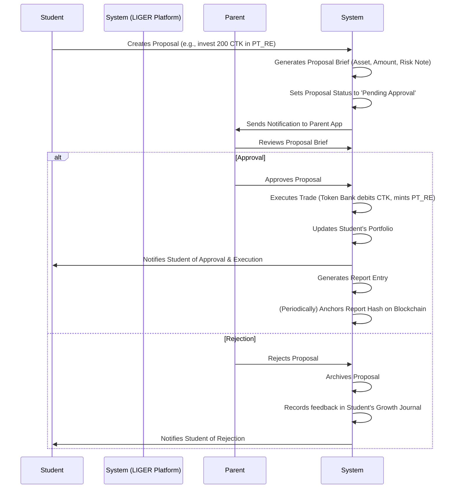

# 🦁 LIGER CLUB — Complete Platform Architecture

**Learn Investing with Grit, Endurance, and Resilience**

A **comprehensive teenage investment education and credibility platform** where students earn tokens, propose investments across multiple verticals, access scholarships, request P2P loans, and build blockchain-anchored credibility scores. Parents maintain **legal custody**: every transaction requires explicit parental approval.

## 1. Core Architecture

**Token Bank (CTK)**: Internal CLUB Token system for all transactions
**Proposal & Parent Approval Engine (PPAM)**: Student proposals → risk assessment → parent approval → execution  
**Student Credibility Score (SCS)**: Composite scoring across 6 domains (Agency, SEL, Financial, Digital, Mindset, Entrepreneurship)
**Blockchain Anchoring**: Immutable audit trails on Polygon testnet

This creates a **safe, compliant, and educational structure**: students practice entrepreneurship and investing skills while parents maintain legal oversight and the system builds verifiable credibility.

---

## 2. Token Bank Model

* **CLUB Token (CTK):** internal currency, earned via chores, gifts, pocket money.
* **Position Tokens (PT_*):** minted only upon trade approval; represent exposure in one of the 7 verticals.
* **Ledger:** Double-entry, append-only; every proposal → pending state until parent approval.

---

## 3. Transaction Flow

1. **Student Proposal**

   * Student browses opportunities in one of the 7 verticals.
   * Prepares a “Proposal Brief” (auto-generated summary with: amount CTK, asset, risk note, learning outcome).
   * Submits to Parent App → status = *Pending Approval*.

2. **Parent Review**

   * Parent app notification → “Student wants to invest 200 CTK in Fractional RE asset XYZ.”
   * Parent sees: risk note, educational context, projected return, student’s Credibility Score.
   * Parent can: **Approve / Reject / Ask Student to Revise**.

3. **Execution**

   * If approved → Token Bank debits CTK, mints PT_*.
   * If rejected → Proposal archived; feedback recorded in student’s growth journal.

4. **Portfolio & Reporting**

   * Student sees updated portfolio (sim or real).
   * Parent can download monthly report + blockchain hash.

---

## 4. The 7 Verticals

1. **Fractional Real Estate (PT_RE)**

   * Proposals = subscribe/redeem property shares.
   * Parent sees property brief (location, appraisal, risk).

2. **Insurance Pools (PT_INS)**

   * Proposals = join/exit risk pools (simulated).
   * Parent sees “probability × payout” educational note.

3. **Equities & F&O (PT_EQ)**

   * Proposals = buy/sell stocks or simulate options.
   * Parent sees “ticker, price, diversification impact.”

4. **Commodities & Gold (PT_CMD)**

   * Proposals = buy/sell units (grams of gold, baskets).
   * Parent sees “inflation hedge” educational note.

5. **P2P Lending (PT_P2P)**

   * Proposals = fund peers/community pools.
   * Parent sees “credit risk, default simulation.”

6. **VC/Hedge Micro-Funds (PT_VC)**

   * Proposals = commit to school project / youth startup micro-funds.
   * Parent sees “fund duration, tranche model, risk.”

7. **Collectibles & Auctions (PT_COL)**

   * Proposals = place bid, buy fraction of art/vintage asset.
   * Parent sees auction terms, reserve price, risk of illiquidity.

---

## 5. Risk & Controls

* **Parent Gatekeeper**: No trade without explicit parent approval.
* **Limits**: Daily/weekly caps (set by parent in app).
* **Educational Note**: Every proposal carries an auto-generated risk/lesson statement.
* **Audit**: Every approval logged; monthly Merkle root anchored on-chain.

---

## 6. Parent App UX

* **Notifications:** “Student submitted proposal #123.”
* **Proposal Brief:**

  * Asset & vertical
  * Amount (CTK)
  * Risk & learning notes
  * Student’s Credibility Score trend
* **Action Buttons:** Approve / Reject / Revise
* **Portfolio View:** Student’s live portfolio + historical decisions
* **Limit Settings:** Per-day, per-vertical, per-transaction caps
* **Export:** Monthly PDF anchored on blockchain

---

## 7. APIs

* **Proposal Service**

  * `POST /proposal` {studentId, vertical, instrument, amount}
  * `GET /proposal/:id` (full brief)
  * `POST /proposal/:id/approve` (parent action)
  * `POST /proposal/:id/reject`

* **Token Bank**

  * `POST /wallet/hold` (on proposal)
  * `POST /wallet/settle` (on approval)
  * `POST /wallet/release` (on rejection)

* **Reporting**

  * `GET /portfolio/:studentId`
  * `GET /reports/:studentId?period=`

* **Gift Management Module**
  * `POST /gift/events`
  * `GET /gift/events/:id/public`
  * `POST /gift/events/:id/catalog`
  * `POST /gift/events/:id/brief`
  * `GET /gift/events/:id/brief/public`
  * `POST /gift/events/:id/intent`
  * `GET /pay/intent/:id`
  * `POST /pay/webhook/:provider`
  * `POST /wallet/credit/from-gift`
  * `GET /gift/receipt/:id`

---

## 8. Build Plan (Parent-First MVP)

* **Sprint 1:** Token Bank + Proposal API + Parent app auth
* **Sprint 2:** Portfolio UI + Proposal Brief generator + Approval workflow
* **Sprint 3:** Real Estate & Equities SIM adapters + Reporting engine
* **Sprint 4:** Add P2P, VC, Collectibles modules + Blockchain anchor
* **GMM S1 (2 wks):** gift-svc, profile-svc (read from scoring), public landing, catalog CRUD
* **GMM S2 (2 wks):** pay-svc with UPI deep link + QR, webhook verify, CTK mint
* **GMM S3 (2 wks):** PayPal/Stripe integration, receipts & PDF, thank-you automation
* **GMM S4 (2 wks):** analytics, donor privacy, impact updates, monthly anchor

---

## 9. Legal & Compliance

* **Onus on Parent:** Parent approval is legally binding consent → all liability rests with guardian.
* **Minors’ role:** Educational only; cannot execute trades independently.
* **System disclaimers:** Every approval flow shows “Parent bears full legal and financial responsibility.”

---

## Parent-Approval Workflow



---

## 14. Production Deployment with Jenkins CI/CD

### 🚀 Jenkins Infrastructure

The LIGER platform includes a comprehensive Jenkins CI/CD pipeline for automated testing, building, and deployment.

#### Quick Start

```bash
# Start Jenkins infrastructure
./liger.sh jenkins start

# Access Jenkins UI
open http://localhost:8080
# Default credentials: admin/admin123

# Check status
./liger.sh jenkins status

# View logs
./liger.sh jenkins logs
```

#### Infrastructure Components

- **Jenkins Controller**: Main CI/CD orchestrator with Blue Ocean UI
- **Jenkins Agent**: Dedicated build agent with Docker and kubectl
- **PostgreSQL**: Database for Jenkins metadata
- **Redis**: Caching layer for build artifacts

#### CI/CD Pipeline Features

1. **Automated Testing**: Full test suite runs on every commit
2. **Security Scanning**: Trivy vulnerability scans and npm audits
3. **Multi-Service Builds**: Parallel Docker image builds for all 15 microservices
4. **Environment Deployment**: Automated staging and production deployments
5. **GitHub Integration**: Webhook triggers and status reporting

#### Available Services

The platform includes 15 microservices, each with dedicated Dockerfiles:

- `proposal-svc` - Investment proposal management
- `approval-svc` - Parent approval workflow
- `assessment-svc` - Educational assessments
- `scoring-svc` - Credibility scoring engine
- `habits-svc` - Habit tracking and rewards
- `risk-svc` - Investment risk analysis
- `notify-svc` - Multi-channel notifications
- `gift-svc` - Gift and token management
- `pay-svc` - Payment processing
- `profile-svc` - Student and parent profiles
- `qr-svc` - QR code generation
- `scholarship-svc` - Scholarship marketplace
- `loan-svc` - P2P education loans
- `dossier-svc` - Digital credibility dossiers
- `escrow-svc` - Secure transaction escrow

#### Management Commands

```bash
# Infrastructure
./liger.sh jenkins start|stop|restart|status|logs

# Database
./liger.sh db:setup|migrate|seed|reset|studio

# Services
./liger.sh services:build|start|stop|restart|status|logs

# Development
./liger.sh dev:install|build|test|lint|clean

# Deployment
./liger.sh deploy:staging|production|rollback

# Monitoring
./liger.sh monitor:health|metrics|alerts
```

#### Production Checklist

- [x] Jenkins infrastructure running
- [ ] Database migrations applied
- [ ] All service Docker images built
- [ ] Environment secrets configured
- [ ] Health checks passing
- [ ] Monitoring alerts configured

### 🔒 Security & Compliance

- **Container Security**: Trivy scans for all Docker images
- **Dependency Audits**: Automated npm audit checks
- **Secret Management**: Encrypted environment variables
- **Access Control**: Role-based Jenkins permissions
- **Audit Logging**: Complete deployment audit trails

---

## 15. Next Steps

1. **Configure Production Secrets**: Set up environment-specific configurations
2. **Deploy to Staging**: Test the full deployment pipeline
3. **Set up Monitoring**: Configure Prometheus/Grafana dashboards
4. **Load Testing**: Validate system performance under load
5. **Security Hardening**: Implement additional security measures

For detailed deployment guides and troubleshooting, see the [DEPLOYMENT.md](./DEPLOYMENT.md) documentation.

````
```
