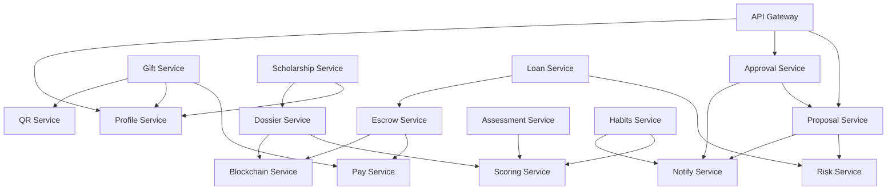

# 🏗️ LIGER Platform Architecture Documentation

## Table of Contents
1. [System Overview](#system-overview)
2. [Core Components](#core-components)
3. [Microservices Architecture](#microservices-architecture)
4. [Data Architecture](#data-architecture)
5. [Security Architecture](#security-architecture)
6. [Integration Patterns](#integration-patterns)
7. [Scalability Design](#scalability-design)
8. [Technology Stack](#technology-stack)

---

## 1. System Overview

### 1.1 Architecture Principles

**LIGER (Learn Investing with Grit, Endurance, and Resilience)** is built on a distributed microservices architecture designed for:

- **Parent-Custodied Safety**: Every transaction requires explicit parental approval
- **Educational Focus**: Comprehensive learning across 6 credibility domains
- **Scalability**: Horizontal scaling capability for global reach
- **Security**: Multi-layer security with blockchain anchoring
- **Compliance**: Regulatory compliance for financial education platforms

### 1.2 High-Level Architecture

```
┌─────────────────────────────────────────────────────────────────┐
│                         LIGER Platform                          │
├─────────────────┬─────────────────┬─────────────────────────────┤
│   Student App   │   Parent App    │      Admin Dashboard        │
│   (React)       │   (React)       │        (React)              │
└─────────────────┴─────────────────┴─────────────────────────────┘
                           │
┌─────────────────────────────────────────────────────────────────┐
│                    API Gateway (NestJS)                         │
│                     Port: 3000                                  │
└─────────────────────────────────────────────────────────────────┘
                           │
┌─────────────────────────────────────────────────────────────────┐
│                   Service Mesh Layer                            │
│              (NATS Event Bus + Load Balancer)                   │
└─────────────────────────────────────────────────────────────────┘
                           │
┌─────────────────────────────────────────────────────────────────┐
│                    Microservices Layer                          │
├──────────┬──────────┬──────────┬──────────┬──────────┬─────────┤
│Proposal  │Approval  │Risk      │Gift      │Payment   │Notify   │
│Service   │Service   │Service   │Service   │Service   │Service  │
│:3001     │:3002     │:3003     │:3004     │:3005     │:3006    │
├──────────┼──────────┼──────────┼──────────┼──────────┼─────────┤
│Profile   │QR        │Scholar   │Loan      │Dossier   │Escrow   │
│Service   │Service   │Service   │Service   │Service   │Service  │
│:3007     │:3008     │:3009     │:3010     │:3011     │:3012    │
├──────────┼──────────┼──────────┼──────────┼──────────┼─────────┤
│Assess    │Scoring   │Habits    │          │          │         │
│Service   │Service   │Service   │          │          │         │
│:3013     │:3014     │:3015     │          │          │         │
└──────────┴──────────┴──────────┴──────────┴──────────┴─────────┘
                           │
┌─────────────────────────────────────────────────────────────────┐
│                     Data Layer                                  │
├─────────────────┬─────────────────┬─────────────────────────────┤
│   PostgreSQL    │     Redis       │     Blockchain              │
│   (Primary DB)  │   (Cache/Queue) │   (Audit Trail)             │
│   Port: 5432    │   Port: 6379    │   Polygon Testnet           │
└─────────────────┴─────────────────┴─────────────────────────────┘
```

### 1.3 Domain Model

The platform operates across **7 Investment Verticals** and **6 Credibility Domains**:

**Investment Verticals:**
1. **Fractional Real Estate** - REITs and property tokens
2. **Crypto & DeFi** - Educational crypto trading
3. **Stock Market** - Fractional stock investments
4. **Commodities** - Gold, silver, agricultural products
5. **Bonds & Fixed Income** - Government and corporate bonds
6. **Alternative Investments** - P2P lending, crowdfunding
7. **ESG & Impact Investing** - Sustainable and social impact investments

**Credibility Domains:**
1. **Agency** - Self-directed learning and initiative
2. **Social-Emotional Learning (SEL)** - Emotional intelligence
3. **Financial Literacy** - Money management skills
4. **Digital Citizenship** - Responsible technology use
5. **Growth Mindset** - Resilience and adaptability
6. **Entrepreneurship** - Innovation and business skills

---

## 2. Core Components

### 2.1 Token Bank System

**CLUB Token (CTK)** - Internal Currency
```typescript
interface ClubToken {
  id: string;
  studentId: string;
  balance: number;
  earned: TransactionHistory[];
  spent: TransactionHistory[];
  locked: LockedTokens[];
}

interface PositionToken {
  id: string;
  symbol: string; // PT_RE, PT_CRYPTO, PT_STOCKS, etc.
  vertical: InvestmentVertical;
  quantity: number;
  purchasePrice: number;
  currentValue: number;
}
```

### 2.2 Proposal & Approval Engine (PPAE)

```typescript
interface InvestmentProposal {
  id: string;
  studentId: string;
  parentId: string;
  vertical: InvestmentVertical;
  assetSymbol: string;
  amount: number; // CTK amount
  riskLevel: RiskLevel;
  learningObjectives: string[];
  status: ProposalStatus;
  createdAt: Date;
  reviewedAt?: Date;
  parentFeedback?: string;
}

enum ProposalStatus {
  DRAFT = 'draft',
  SUBMITTED = 'submitted',
  UNDER_REVIEW = 'under_review',
  APPROVED = 'approved',
  REJECTED = 'rejected',
  EXECUTED = 'executed'
}
```

### 2.3 Student Credibility Score (SCS)

```typescript
interface CredibilityScore {
  studentId: string;
  overall: number; // 0-1000
  domains: {
    agency: DomainScore;
    sel: DomainScore;
    financial: DomainScore;
    digital: DomainScore;
    mindset: DomainScore;
    entrepreneurship: DomainScore;
  };
  history: ScoreHistory[];
  achievements: Achievement[];
}

interface DomainScore {
  current: number; // 0-100
  trend: 'up' | 'down' | 'stable';
  badges: Badge[];
  milestones: Milestone[];
}
```

---

## 3. Microservices Architecture

### 3.1 Service Inventory

| Service | Port | Responsibility | Dependencies |
|---------|------|----------------|--------------|
| `api-gateway` | 3000 | Request routing, authentication | All services |
| `proposal-svc` | 3001 | Investment proposal management | risk-svc, notify-svc |
| `approval-svc` | 3002 | Parent approval workflow | proposal-svc, notify-svc |
| `assessment-svc` | 3013 | Educational assessments | scoring-svc |
| `scoring-svc` | 3014 | Credibility score calculation | All educational services |
| `habits-svc` | 3015 | Habit tracking and analytics | scoring-svc, notify-svc |
| `risk-svc` | 3003 | Investment risk analysis | External market data |
| `notify-svc` | 3006 | Multi-channel notifications | All services |
| `gift-svc` | 3004 | Gift and token management | pay-svc, profile-svc |
| `pay-svc` | 3005 | Payment processing | External payment gateways |
| `profile-svc` | 3007 | User profile management | auth-svc |
| `qr-svc` | 3008 | QR code generation | gift-svc, pay-svc |
| `scholarship-svc` | 3009 | Global scholarship marketplace | profile-svc, dossier-svc |
| `loan-svc` | 3010 | P2P education loans | risk-svc, escrow-svc |
| `dossier-svc` | 3011 | Digital credibility dossiers | scoring-svc, blockchain-svc |
| `escrow-svc` | 3012 | Secure transaction escrow | pay-svc, blockchain-svc |

### 3.2 Communication Patterns

#### 3.2.1 Synchronous Communication
- **HTTP/REST APIs** for real-time operations
- **gRPC** for high-performance inter-service calls
- **GraphQL** for complex client queries

#### 3.2.2 Asynchronous Communication
- **NATS Event Bus** for event-driven architecture
- **Message Queues** for reliable processing
- **Event Sourcing** for audit trails

```typescript
// Event Bus Pattern Example
interface ProposalSubmittedEvent {
  eventType: 'proposal.submitted';
  proposalId: string;
  studentId: string;
  parentId: string;
  amount: number;
  vertical: string;
  timestamp: Date;
}

// Service subscribes to events
@EventHandler('proposal.submitted')
async handleProposalSubmitted(event: ProposalSubmittedEvent) {
  // Risk service processes the proposal
  const riskAssessment = await this.assessRisk(event);
  
  // Emit risk assessment complete event
  this.eventBus.emit('risk.assessment.complete', {
    proposalId: event.proposalId,
    riskLevel: riskAssessment.level,
    riskFactors: riskAssessment.factors
  });
}
```

### 3.3 Service Dependencies Graph



---

## 4. Data Architecture

### 4.1 Database Design Philosophy

- **Domain-Driven Design**: Each service owns its domain data
- **Event Sourcing**: Immutable event log for audit trails
- **CQRS**: Separate read and write models for performance
- **Polyglot Persistence**: Right database for each use case

### 4.2 Primary Database Schema (PostgreSQL)

#### Core Entities

```sql
-- Students and Parents
CREATE TABLE students (
    id UUID PRIMARY KEY,
    email VARCHAR(255) UNIQUE NOT NULL,
    first_name VARCHAR(100) NOT NULL,
    last_name VARCHAR(100) NOT NULL,
    date_of_birth DATE NOT NULL,
    parent_id UUID REFERENCES parents(id),
    credibility_score JSONB,
    created_at TIMESTAMP DEFAULT NOW()
);

CREATE TABLE parents (
    id UUID PRIMARY KEY,
    email VARCHAR(255) UNIQUE NOT NULL,
    first_name VARCHAR(100) NOT NULL,
    last_name VARCHAR(100) NOT NULL,
    phone VARCHAR(20),
    approval_settings JSONB,
    created_at TIMESTAMP DEFAULT NOW()
);

-- Token System
CREATE TABLE token_accounts (
    id UUID PRIMARY KEY,
    student_id UUID REFERENCES students(id),
    ctk_balance DECIMAL(15,2) DEFAULT 0,
    locked_balance DECIMAL(15,2) DEFAULT 0,
    total_earned DECIMAL(15,2) DEFAULT 0,
    total_spent DECIMAL(15,2) DEFAULT 0,
    updated_at TIMESTAMP DEFAULT NOW()
);

CREATE TABLE position_tokens (
    id UUID PRIMARY KEY,
    student_id UUID REFERENCES students(id),
    symbol VARCHAR(20) NOT NULL, -- PT_RE, PT_CRYPTO, etc.
    vertical investment_vertical NOT NULL,
    quantity DECIMAL(15,8) NOT NULL,
    purchase_price DECIMAL(15,2) NOT NULL,
    current_value DECIMAL(15,2),
    purchase_date TIMESTAMP DEFAULT NOW()
);

-- Proposals and Approvals
CREATE TABLE investment_proposals (
    id UUID PRIMARY KEY,
    student_id UUID REFERENCES students(id),
    parent_id UUID REFERENCES parents(id),
    vertical investment_vertical NOT NULL,
    asset_symbol VARCHAR(50) NOT NULL,
    amount DECIMAL(15,2) NOT NULL,
    risk_level risk_level NOT NULL,
    learning_objectives TEXT[],
    proposal_brief TEXT NOT NULL,
    status proposal_status DEFAULT 'draft',
    risk_assessment JSONB,
    parent_feedback TEXT,
    created_at TIMESTAMP DEFAULT NOW(),
    reviewed_at TIMESTAMP,
    executed_at TIMESTAMP
);

-- Credibility Scoring
CREATE TABLE credibility_scores (
    id UUID PRIMARY KEY,
    student_id UUID REFERENCES students(id),
    domain credibility_domain NOT NULL,
    score INTEGER CHECK (score >= 0 AND score <= 100),
    evidence JSONB,
    calculated_at TIMESTAMP DEFAULT NOW(),
    UNIQUE(student_id, domain, calculated_at)
);
```

#### Enums and Types

```sql
CREATE TYPE investment_vertical AS ENUM (
    'fractional_real_estate',
    'crypto_defi',
    'stock_market',
    'commodities',
    'bonds_fixed_income',
    'alternative_investments',
    'esg_impact'
);

CREATE TYPE credibility_domain AS ENUM (
    'agency',
    'sel',
    'financial',
    'digital',
    'mindset',
    'entrepreneurship'
);

CREATE TYPE risk_level AS ENUM ('low', 'medium', 'high', 'very_high');
CREATE TYPE proposal_status AS ENUM ('draft', 'submitted', 'under_review', 'approved', 'rejected', 'executed');
```

### 4.3 Cache Strategy (Redis)

```typescript
// Cache Patterns
interface CacheStrategy {
  // User sessions and authentication
  'session:${userId}': UserSession;
  
  // Frequently accessed scores
  'score:${studentId}': CredibilityScore;
  
  // Real-time market data
  'market:${symbol}': MarketData;
  
  // Parent approval queue
  'approvals:${parentId}': ProposalId[];
  
  // Rate limiting
  'rate_limit:${userId}:${endpoint}': RequestCount;
}

// Redis Configuration
const redis = new Redis({
  host: process.env.REDIS_HOST,
  port: parseInt(process.env.REDIS_PORT),
  retryDelayOnFailover: 100,
  maxRetriesPerRequest: 3,
  lazyConnect: true,
});

// Cache Implementation
@Injectable()
export class CacheService {
  async getCredibilityScore(studentId: string): Promise<CredibilityScore | null> {
    const cached = await this.redis.get(`score:${studentId}`);
    return cached ? JSON.parse(cached) : null;
  }
  
  async setCredibilityScore(studentId: string, score: CredibilityScore): Promise<void> {
    await this.redis.setex(`score:${studentId}`, 3600, JSON.stringify(score));
  }
}
```

### 4.4 Blockchain Integration (Polygon)

```typescript
// Blockchain Anchoring Service
@Injectable()
export class BlockchainService {
  private web3: Web3;
  private contract: Contract;
  
  async anchorAuditTrail(data: AuditTrailData): Promise<string> {
    const hash = this.generateHash(data);
    
    try {
      const transaction = await this.contract.methods
        .storeHash(hash, data.timestamp)
        .send({ from: this.account });
        
      return transaction.transactionHash;
    } catch (error) {
      this.logger.error('Blockchain anchoring failed', error);
      throw new BlockchainError('Failed to anchor audit trail');
    }
  }
  
  async verifyAuditTrail(hash: string): Promise<boolean> {
    try {
      const stored = await this.contract.methods.getHash(hash).call();
      return stored.exists;
    } catch (error) {
      this.logger.error('Blockchain verification failed', error);
      return false;
    }
  }
}

interface AuditTrailData {
  proposalId: string;
  studentId: string;
  parentId: string;
  action: string;
  timestamp: Date;
  metadata: any;
}
```

---

## 5. Security Architecture

### 5.1 Multi-Layer Security Model

```
┌─────────────────────────────────────────────────────────────────┐
│                      Security Layers                            │
├─────────────────────────────────────────────────────────────────┤
│ Layer 1: Network Security (HTTPS, VPN, Firewalls)              │
├─────────────────────────────────────────────────────────────────┤
│ Layer 2: API Gateway (Rate Limiting, Authentication)           │
├─────────────────────────────────────────────────────────────────┤
│ Layer 3: Service Authentication (JWT, mTLS)                    │
├─────────────────────────────────────────────────────────────────┤
│ Layer 4: Authorization (RBAC, ABAC)                            │
├─────────────────────────────────────────────────────────────────┤
│ Layer 5: Data Encryption (At Rest, In Transit)                 │
├─────────────────────────────────────────────────────────────────┤
│ Layer 6: Audit & Monitoring (Logging, Blockchain Anchoring)   │
└─────────────────────────────────────────────────────────────────┘
```

### 5.2 Authentication & Authorization

```typescript
// JWT Authentication Strategy
@Injectable()
export class JwtStrategy extends PassportStrategy(Strategy) {
  constructor(private userService: UserService) {
    super({
      jwtFromRequest: ExtractJwt.fromAuthHeaderAsBearerToken(),
      ignoreExpiration: false,
      secretOrKey: process.env.JWT_SECRET,
    });
  }
  
  async validate(payload: JwtPayload): Promise<User> {
    const user = await this.userService.findById(payload.sub);
    if (!user || !user.isActive) {
      throw new UnauthorizedException();
    }
    return user;
  }
}

// Role-Based Access Control
enum UserRole {
  STUDENT = 'student',
  PARENT = 'parent',
  ADMIN = 'admin',
  EDUCATOR = 'educator'
}

interface Permission {
  resource: string;
  action: string;
  conditions?: Record<string, any>;
}

@Injectable()
export class AuthorizationService {
  async hasPermission(
    user: User, 
    resource: string, 
    action: string,
    context?: any
  ): Promise<boolean> {
    const permissions = await this.getUserPermissions(user);
    
    return permissions.some(permission => 
      permission.resource === resource &&
      permission.action === action &&
      this.evaluateConditions(permission.conditions, context, user)
    );
  }
}

// Parent Approval Guard
@Injectable()
export class ParentApprovalGuard implements CanActivate {
  canActivate(context: ExecutionContext): boolean {
    const request = context.switchToHttp().getRequest();
    const user = request.user;
    const proposalId = request.params.proposalId;
    
    // Students can only access their own proposals
    if (user.role === UserRole.STUDENT) {
      return this.proposalService.isStudentProposal(user.id, proposalId);
    }
    
    // Parents can only access their children's proposals
    if (user.role === UserRole.PARENT) {
      return this.proposalService.isParentProposal(user.id, proposalId);
    }
    
    return false;
  }
}
```

### 5.3 Data Protection

```typescript
// Encryption Service
@Injectable()
export class EncryptionService {
  private readonly algorithm = 'aes-256-gcm';
  private readonly keyLength = 32;
  
  encrypt(text: string, key?: Buffer): EncryptedData {
    const encryptionKey = key || Buffer.from(process.env.ENCRYPTION_KEY, 'hex');
    const iv = crypto.randomBytes(16);
    const cipher = crypto.createCipher(this.algorithm, encryptionKey);
    
    cipher.setAAD(Buffer.from('LIGER-PLATFORM'));
    
    let encrypted = cipher.update(text, 'utf8', 'hex');
    encrypted += cipher.final('hex');
    
    const authTag = cipher.getAuthTag();
    
    return {
      encryptedData: encrypted,
      iv: iv.toString('hex'),
      authTag: authTag.toString('hex')
    };
  }
  
  decrypt(encryptedData: EncryptedData, key?: Buffer): string {
    const decryptionKey = key || Buffer.from(process.env.ENCRYPTION_KEY, 'hex');
    const decipher = crypto.createDecipher(this.algorithm, decryptionKey);
    
    decipher.setAAD(Buffer.from('LIGER-PLATFORM'));
    decipher.setAuthTag(Buffer.from(encryptedData.authTag, 'hex'));
    
    let decrypted = decipher.update(encryptedData.encryptedData, 'hex', 'utf8');
    decrypted += decipher.final('utf8');
    
    return decrypted;
  }
}

// PII Protection
@Injectable()
export class PIIProtectionService {
  @Encrypt(['email', 'phone', 'ssn'])
  async createStudent(studentData: CreateStudentDto): Promise<Student> {
    // Automatically encrypt PII fields before saving
    return this.studentRepository.save(studentData);
  }
  
  @Decrypt(['email', 'phone'])
  async getStudentProfile(studentId: string): Promise<Student> {
    // Automatically decrypt PII fields after loading
    return this.studentRepository.findById(studentId);
  }
}
```

---

## 6. Integration Patterns

### 6.1 External Service Integration

```typescript
// Payment Gateway Integration
@Injectable()
export class PaymentGatewayService {
  private gateways: Map<PaymentProvider, PaymentGateway> = new Map();
  
  constructor() {
    this.gateways.set('stripe', new StripeGateway());
    this.gateways.set('paypal', new PayPalGateway());
    this.gateways.set('razorpay', new RazorPayGateway());
  }
  
  async processPayment(
    provider: PaymentProvider,
    amount: number,
    currency: string,
    metadata: PaymentMetadata
  ): Promise<PaymentResult> {
    const gateway = this.gateways.get(provider);
    
    try {
      const result = await gateway.charge({
        amount: amount * 100, // Convert to cents
        currency,
        metadata,
        idempotencyKey: this.generateIdempotencyKey(metadata)
      });
      
      // Record transaction for audit
      await this.auditService.recordPayment({
        provider,
        amount,
        currency,
        transactionId: result.transactionId,
        status: result.status
      });
      
      return result;
    } catch (error) {
      this.logger.error(`Payment failed for provider ${provider}`, error);
      throw new PaymentProcessingError(error.message);
    }
  }
}

// Market Data Integration
@Injectable()
export class MarketDataService {
  private providers: MarketDataProvider[] = [
    new AlphaVantageProvider(),
    new YahooFinanceProvider(),
    new IEXCloudProvider()
  ];
  
  async getAssetPrice(symbol: string): Promise<AssetPrice> {
    // Try providers in order with fallback
    for (const provider of this.providers) {
      try {
        const price = await provider.getPrice(symbol);
        
        // Cache the result
        await this.cacheService.set(`price:${symbol}`, price, 60); // 1 minute TTL
        
        return price;
      } catch (error) {
        this.logger.warn(`Provider ${provider.name} failed for ${symbol}`, error);
        continue;
      }
    }
    
    throw new MarketDataUnavailableError(`No price data available for ${symbol}`);
  }
}
```

### 6.2 Event-Driven Integration

```typescript
// Event Bus Implementation
@Injectable()
export class EventBusService {
  private nats: Client;
  private eventHandlers: Map<string, EventHandler[]> = new Map();
  
  async connect(): Promise<void> {
    this.nats = await connect({
      servers: process.env.NATS_SERVERS?.split(',') || ['nats://localhost:4222'],
      reconnect: true,
      maxReconnectAttempts: 5,
      reconnectTimeWait: 2000
    });
    
    this.logger.log('Connected to NATS event bus');
  }
  
  async publish(eventType: string, data: any): Promise<void> {
    const event = {
      id: uuid(),
      type: eventType,
      data,
      timestamp: new Date(),
      source: process.env.SERVICE_NAME
    };
    
    await this.nats.publish(eventType, JSON.stringify(event));
    
    // Also store in event store for replay capability
    await this.eventStore.append(event);
  }
  
  async subscribe(eventType: string, handler: EventHandler): Promise<void> {
    const handlers = this.eventHandlers.get(eventType) || [];
    handlers.push(handler);
    this.eventHandlers.set(eventType, handlers);
    
    const subscription = this.nats.subscribe(eventType);
    
    for await (const msg of subscription) {
      const event = JSON.parse(msg.data.toString());
      
      for (const eventHandler of handlers) {
        try {
          await eventHandler.handle(event);
        } catch (error) {
          this.logger.error(`Event handler failed for ${eventType}`, error);
          // Dead letter queue for failed events
          await this.deadLetterQueue.add(event, error);
        }
      }
    }
  }
}

// Saga Pattern for Complex Workflows
@Injectable()
export class ProposalApprovalSaga {
  @SagaStart()
  @EventsHandler(ProposalSubmittedEvent)
  async handleProposalSubmitted(event: ProposalSubmittedEvent): Promise<void> {
    // Step 1: Risk Assessment
    await this.commandBus.execute(
      new AssessProposalRiskCommand(event.proposalId)
    );
  }
  
  @EventsHandler(RiskAssessmentCompletedEvent)
  async handleRiskAssessmentCompleted(event: RiskAssessmentCompletedEvent): Promise<void> {
    // Step 2: Send to Parent for Approval
    await this.commandBus.execute(
      new SendApprovalRequestCommand(event.proposalId, event.riskLevel)
    );
  }
  
  @EventsHandler(ProposalApprovedEvent)
  async handleProposalApproved(event: ProposalApprovedEvent): Promise<void> {
    // Step 3: Execute Trade
    await this.commandBus.execute(
      new ExecuteTradeCommand(event.proposalId)
    );
  }
  
  @EventsHandler(ProposalRejectedEvent)
  async handleProposalRejected(event: ProposalRejectedEvent): Promise<void> {
    // Compensation: Archive proposal and notify student
    await this.commandBus.execute(
      new ArchiveProposalCommand(event.proposalId, event.reason)
    );
  }
}
```

---

## 7. Scalability Design

### 7.1 Horizontal Scaling Strategy

```yaml
# Kubernetes Deployment Example
apiVersion: apps/v1
kind: Deployment
metadata:
  name: proposal-service
spec:
  replicas: 3
  selector:
    matchLabels:
      app: proposal-service
  template:
    metadata:
      labels:
        app: proposal-service
    spec:
      containers:
      - name: proposal-service
        image: liger/proposal-svc:latest
        ports:
        - containerPort: 3001
        env:
        - name: DATABASE_URL
          valueFrom:
            secretKeyRef:
              name: database-secret
              key: url
        resources:
          requests:
            memory: "256Mi"
            cpu: "250m"
          limits:
            memory: "512Mi"
            cpu: "500m"
        livenessProbe:
          httpGet:
            path: /health
            port: 3001
          initialDelaySeconds: 30
          periodSeconds: 10
        readinessProbe:
          httpGet:
            path: /ready
            port: 3001
          initialDelaySeconds: 5
          periodSeconds: 5
---
apiVersion: v1
kind: Service
metadata:
  name: proposal-service
spec:
  selector:
    app: proposal-service
  ports:
  - protocol: TCP
    port: 80
    targetPort: 3001
  type: LoadBalancer
```

### 7.2 Database Scaling

```typescript
// Read Replica Configuration
@Injectable()
export class DatabaseService {
  private readonly writeConnection: DataSource;
  private readonly readConnections: DataSource[];
  
  constructor() {
    // Master database for writes
    this.writeConnection = new DataSource({
      type: 'postgres',
      host: process.env.DB_WRITE_HOST,
      port: parseInt(process.env.DB_PORT),
      username: process.env.DB_USERNAME,
      password: process.env.DB_PASSWORD,
      database: process.env.DB_NAME,
      entities: [__dirname + '/../**/*.entity{.ts,.js}'],
      logging: process.env.NODE_ENV === 'development'
    });
    
    // Read replicas for queries
    this.readConnections = process.env.DB_READ_HOSTS?.split(',').map(host => 
      new DataSource({
        type: 'postgres',
        host,
        port: parseInt(process.env.DB_PORT),
        username: process.env.DB_USERNAME,
        password: process.env.DB_PASSWORD,
        database: process.env.DB_NAME,
        entities: [__dirname + '/../**/*.entity{.ts,.js}'],
        extra: { readonly: true }
      })
    ) || [];
  }
  
  getWriteConnection(): DataSource {
    return this.writeConnection;
  }
  
  getReadConnection(): DataSource {
    // Load balance across read replicas
    const index = Math.floor(Math.random() * this.readConnections.length);
    return this.readConnections[index] || this.writeConnection;
  }
}

// Sharding Strategy for Large Datasets
@Injectable()
export class ShardingService {
  private shards: Map<string, DataSource> = new Map();
  
  constructor() {
    // Initialize shards based on geographic regions
    this.shards.set('us-east', this.createShard('us-east-db'));
    this.shards.set('us-west', this.createShard('us-west-db'));
    this.shards.set('eu', this.createShard('eu-db'));
    this.shards.set('asia', this.createShard('asia-db'));
  }
  
  getShard(studentId: string): DataSource {
    // Shard based on student ID hash
    const hash = crypto.createHash('md5').update(studentId).digest('hex');
    const shardKey = this.determineShardFromHash(hash);
    
    return this.shards.get(shardKey) || this.shards.get('us-east');
  }
  
  private determineShardFromHash(hash: string): string {
    const value = parseInt(hash.substring(0, 8), 16);
    const shardCount = this.shards.size;
    const shardIndex = value % shardCount;
    
    return Array.from(this.shards.keys())[shardIndex];
  }
}
```

### 7.3 Caching Strategy

```typescript
// Multi-Level Caching
@Injectable()
export class CacheManager {
  private l1Cache: NodeCache; // In-memory cache
  private l2Cache: Redis; // Distributed cache
  private l3Cache: CDN; // Content delivery network
  
  constructor() {
    this.l1Cache = new NodeCache({ 
      stdTTL: 300, // 5 minutes
      maxKeys: 1000 
    });
  }
  
  async get(key: string): Promise<any> {
    // L1: Check in-memory cache
    let value = this.l1Cache.get(key);
    if (value) {
      return value;
    }
    
    // L2: Check distributed cache
    value = await this.l2Cache.get(key);
    if (value) {
      // Promote to L1 cache
      this.l1Cache.set(key, value);
      return JSON.parse(value);
    }
    
    // L3: Check CDN cache for static content
    if (this.isStaticContent(key)) {
      value = await this.l3Cache.get(key);
      if (value) {
        // Promote to both L1 and L2
        this.l1Cache.set(key, value);
        await this.l2Cache.setex(key, 3600, JSON.stringify(value));
        return value;
      }
    }
    
    return null;
  }
  
  async set(key: string, value: any, ttl?: number): Promise<void> {
    // Set in all cache levels
    this.l1Cache.set(key, value, ttl || 300);
    await this.l2Cache.setex(key, ttl || 3600, JSON.stringify(value));
    
    if (this.isStaticContent(key)) {
      await this.l3Cache.set(key, value);
    }
  }
  
  async invalidate(pattern: string): Promise<void> {
    // Invalidate across all cache levels
    this.l1Cache.flushAll();
    
    const keys = await this.l2Cache.keys(pattern);
    if (keys.length > 0) {
      await this.l2Cache.del(...keys);
    }
    
    await this.l3Cache.purge(pattern);
  }
}
```

---

## 8. Technology Stack

### 8.1 Backend Technologies

| Category | Technology | Version | Purpose |
|----------|------------|---------|---------|
| Runtime | Node.js | 18 LTS | JavaScript runtime |
| Framework | NestJS | 10.x | Microservices framework |
| Language | TypeScript | 5.x | Type-safe development |
| Database | PostgreSQL | 14.x | Primary data storage |
| Cache | Redis | 7.x | Caching and queuing |
| Message Queue | NATS | 2.x | Event streaming |
| ORM | Prisma | 5.x | Database toolkit |
| Validation | class-validator | 0.14.x | Request validation |
| Documentation | Swagger/OpenAPI | 3.0 | API documentation |
| Testing | Jest | 29.x | Unit and integration testing |

### 8.2 Frontend Technologies

| Category | Technology | Version | Purpose |
|----------|------------|---------|---------|
| Framework | React | 18.x | UI framework |
| State Management | Zustand | 4.x | Client state management |
| Styling | Tailwind CSS | 3.x | Utility-first CSS |
| Build Tool | Vite | 4.x | Fast build tool |
| Mobile | React Native | 0.72.x | Mobile applications |
| Charts | Chart.js | 4.x | Data visualization |
| Forms | React Hook Form | 7.x | Form handling |
| HTTP Client | Axios | 1.x | API communication |

### 8.3 Infrastructure Technologies

| Category | Technology | Version | Purpose |
|----------|------------|---------|---------|
| Containerization | Docker | 24.x | Application packaging |
| Orchestration | Kubernetes | 1.28.x | Container orchestration |
| CI/CD | Jenkins | 2.414.x | Continuous integration |
| CI/CD | GitHub Actions | - | Git-based CI/CD |
| Monitoring | Prometheus | 2.x | Metrics collection |
| Logging | ELK Stack | 8.x | Log aggregation |
| Tracing | Jaeger | 1.x | Distributed tracing |
| Security | Vault | 1.x | Secret management |

### 8.4 Blockchain Technologies

| Category | Technology | Purpose |
|----------|------------|---------|
| Network | Polygon (Matic) | Layer 2 Ethereum scaling |
| Smart Contracts | Solidity | Contract development |
| Web3 Library | Web3.js | Blockchain interaction |
| Wallet Integration | MetaMask SDK | Wallet connectivity |
| IPFS | IPFS | Decentralized file storage |

### 8.5 External Integrations

| Category | Providers | Purpose |
|----------|-----------|---------|
| Payment Processing | Stripe, PayPal, Razorpay | Payment handling |
| Market Data | Alpha Vantage, Yahoo Finance | Asset price feeds |
| Email Service | SendGrid, AWS SES | Email notifications |
| SMS Service | Twilio, AWS SNS | SMS notifications |
| Push Notifications | Firebase FCM | Mobile push notifications |
| File Storage | AWS S3, Google Cloud Storage | File and media storage |
| CDN | CloudFlare, AWS CloudFront | Content delivery |
| Analytics | Google Analytics, Mixpanel | User behavior tracking |

---

## Conclusion

The LIGER platform architecture is designed for scale, security, and educational effectiveness. The microservices architecture enables independent scaling and deployment of components, while the comprehensive security model ensures compliance with financial regulations and protection of student data.

Key architectural strengths:
- **Modular Design**: Easy to extend and modify individual components
- **Scalable Infrastructure**: Horizontal scaling capabilities across all layers
- **Security First**: Multi-layer security with audit trails and compliance
- **Event-Driven**: Resilient and decoupled service communication
- **Educational Focus**: Purpose-built for teenage financial education

This architecture supports the platform's mission to provide safe, compliant, and effective financial education while maintaining parental oversight and building verifiable student credibility.