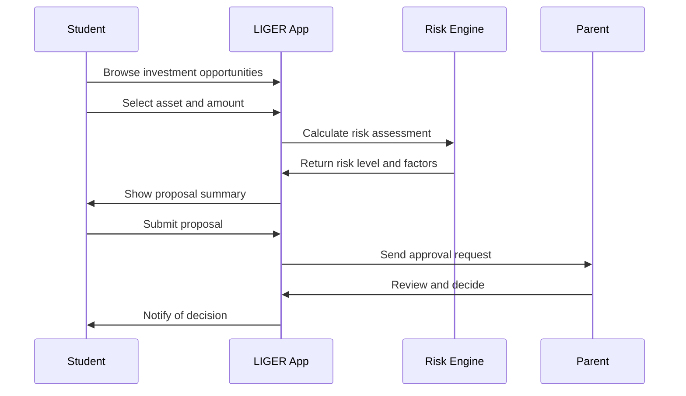
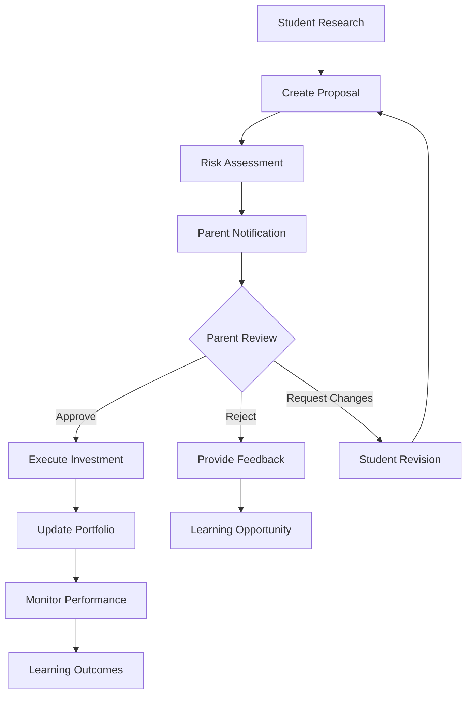
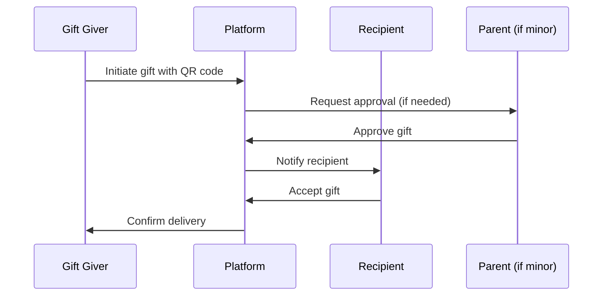

# 📚 LIGER Platform User Guide

## Table of Contents
1. [Getting Started](#getting-started)
2. [Student App Guide](#student-app-guide)
3. [Parent App Guide](#parent-app-guide)
4. [Understanding the Platform](#understanding-the-platform)
5. [Investment Process](#investment-process)
6. [Credibility System](#credibility-system)
7. [Gift & Token System](#gift--token-system)
8. [Scholarships & Loans](#scholarships--loans)
9. [Safety & Security](#safety--security)
10. [Troubleshooting](#troubleshooting)

---

## 1. Getting Started

### 1.1 System Requirements

**For Students (Age 13-18):**
- Smartphone or tablet with iOS 12+ or Android 8+
- Parent/guardian approval for account creation
- Basic understanding of money and saving concepts

**For Parents:**
- Smartphone with iOS 12+ or Android 8+
- Valid email address and phone number
- Legal guardian status of the student

### 1.2 Account Setup

#### Step 1: Parent Creates Account
1. Download the **LIGER Parent App** from App Store/Google Play
2. Sign up with email and verify your identity
3. Complete parent verification process
4. Set up your approval preferences

#### Step 2: Student Account Creation
1. Parent invites student through the Parent App
2. Student downloads **LIGER Student App**
3. Student completes profile setup with parent approval
4. Initial credibility assessment (takes ~15 minutes)

#### Step 3: Initial Token Allocation
1. Parent can gift initial CLUB Tokens (CTK)
2. Student completes onboarding tutorials
3. First small investment proposal practice
4. Parent approval workflow demonstration

### 1.3 First Steps Checklist

- [ ] Parent and student apps installed
- [ ] Identity verification completed
- [ ] Initial credibility assessment done
- [ ] First CTK tokens received
- [ ] Completed platform tutorial
- [ ] Made first practice proposal
- [ ] Understood approval process

---

## 2. Student App Guide

### 2.1 Dashboard Overview

```
┌─────────────────────────────────────────────────────┐
│                LIGER Student App                     │
├─────────────────┬───────────────────────────────────┤
│ Portfolio       │          Credibility Score        │
│ 1,250 CTK       │              738/1000             │
│ 3 Positions     │         ████████░░ 73.8%          │
│ +12.5% Growth   │                                   │
├─────────────────┴───────────────────────────────────┤
│                   Quick Actions                      │
│  [New Proposal] [View Portfolio] [Assessments]      │
├─────────────────────────────────────────────────────┤
│              Recent Activity                         │
│ ○ Real Estate proposal approved                      │
│ ○ Completed Financial Literacy quiz                  │
│ ○ Earned 50 CTK from chores                         │
│ ○ Crypto position gained 5.2%                       │
└─────────────────────────────────────────────────────┘
```

### 2.2 Creating Investment Proposals

#### Investment Verticals Available:

**1. Fractional Real Estate**
- REITs (Real Estate Investment Trusts)
- Property crowdfunding platforms
- Commercial real estate tokens

**2. Stock Market**
- Individual stocks (educational selections)
- ETFs and index funds
- Blue-chip companies

**3. Crypto & DeFi**
- Educational crypto positions (Bitcoin, Ethereum)
- Staking opportunities
- DeFi learning protocols

**4. Commodities**
- Precious metals (Gold, Silver)
- Agricultural commodities
- Energy commodities

**5. Bonds & Fixed Income**
- Government bonds
- Corporate bonds
- High-yield savings alternatives

**6. Alternative Investments**
- P2P lending
- Crowdfunding projects
- Startup equity (educational)

**7. ESG & Impact Investing**
- Environmental projects
- Social impact bonds
- Sustainable development funds

#### Proposal Creation Process:



**Step-by-Step:**

1. **Browse Opportunities**
   ```
   Tap "New Proposal" → Select Vertical → Browse Assets
   
   Example: Fractional Real Estate → Fundrise eREIT
   Current Price: $10.45 per share
   Minimum Investment: 100 CTK
   Risk Level: Medium
   Expected Return: 8-12% annually
   ```

2. **Create Proposal**
   ```
   Amount: 500 CTK
   Asset: Fundrise eREIT (FREI)
   Learning Goals:
   - Understand real estate markets
   - Learn about REITs
   - Diversify investment portfolio
   
   Risk Assessment: Medium
   - Real estate market volatility
   - Interest rate sensitivity
   - Liquidity considerations
   ```

3. **Proposal Brief Generation**
   ```
   Proposal Summary:
   Student wants to invest 500 CTK (~$50) in Fundrise eREIT
   
   Learning Objectives:
   • Understanding real estate investment principles
   • Learning about REIT structure and benefits
   • Portfolio diversification concepts
   
   Risk Factors:
   • Medium risk due to market volatility
   • Potential for 8-12% annual returns
   • Educational value: High
   
   Parent Approval Required: Yes
   ```

### 2.3 Portfolio Management

#### Portfolio Dashboard:
```
┌─────────────────────────────────────────────────────┐
│                  My Portfolio                        │
├─────────────────────────────────────────────────────┤
│ Total Value: 1,250 CTK ($125.00)                   │
│ Cash Available: 450 CTK                             │
│ Invested: 800 CTK                                   │
│ Total Return: +12.5% (+125 CTK)                     │
├─────────────────────────────────────────────────────┤
│                   Positions                          │
├─────────────────────────────────────────────────────┤
│ PT_RE  | Fundrise eREIT    | 300 CTK | +8.2%       │
│ PT_STK | Apple Inc (AAPL)  | 250 CTK | +15.6%      │
│ PT_CRY | Bitcoin (BTC)     | 250 CTK | +22.1%      │
├─────────────────────────────────────────────────────┤
│              Performance Chart                       │
│        1M    3M    6M    1Y    All                  │
│     [████████████████████████████]                  │
└─────────────────────────────────────────────────────┘
```

#### Position Details:
```
┌─────────────────────────────────────────────────────┐
│            Apple Inc (AAPL) - PT_STK                │
├─────────────────────────────────────────────────────┤
│ Quantity: 1.34 shares                               │
│ Purchase Price: $186.50                             │
│ Current Price: $215.78                              │
│ Gain/Loss: +$39.24 (+15.6%)                        │
│ Purchase Date: March 15, 2025                       │
├─────────────────────────────────────────────────────┤
│              Learning Progress                       │
│ ✅ Understood P/E ratio concept                     │
│ ✅ Learned about dividend payments                  │
│ ⏳ Research quarterly earnings impact              │
│ ⏳ Compare with tech sector peers                  │
├─────────────────────────────────────────────────────┤
│                News & Updates                       │
│ • Q3 earnings beat expectations (+2.3%)            │
│ • New iPhone launch announced                       │
│ • Dividend payment scheduled for Nov 15            │
└─────────────────────────────────────────────────────┘
```

### 2.4 Learning & Assessments

#### Credibility Domains:

**1. Agency (Self-Directed Learning)**
- Complete learning modules independently
- Set and achieve personal goals
- Take initiative in research

**2. Social-Emotional Learning (SEL)**
- Demonstrate emotional regulation
- Show empathy in peer discussions
- Handle investment losses maturely

**3. Financial Literacy**
- Understand basic financial concepts
- Calculate returns and risks
- Make informed investment decisions

**4. Digital Citizenship**
- Use technology responsibly
- Protect personal information
- Avoid online scams

**5. Growth Mindset**
- Learn from mistakes
- Embrace challenges
- Persist through difficulties

**6. Entrepreneurship**
- Identify opportunities
- Think creatively
- Understand business concepts

#### Sample Assessment:

```
┌─────────────────────────────────────────────────────┐
│         Financial Literacy Assessment                │
├─────────────────────────────────────────────────────┤
│ Question 3 of 10                                    │
│                                                     │
│ Your Bitcoin investment drops 15% in value.        │
│ What should you do?                                 │
│                                                     │
│ A) Sell immediately to avoid further losses        │
│ B) Research why it dropped and hold if             │
│    fundamentals are strong                          │
│ C) Buy more to "average down"                      │
│ D) Panic and ask parents to fix it                 │
│                                                     │
│                          [Next]                     │
└─────────────────────────────────────────────────────┘
```

### 2.5 Earning CTK Tokens

#### Ways to Earn Tokens:

**1. Chores & Tasks**
```
┌─────────────────────────────────────────────────────┐
│                Available Tasks                       │
├─────────────────────────────────────────────────────┤
│ 🧹 Clean bedroom           | 25 CTK | Due: Today    │
│ 📚 Complete homework       | 15 CTK | Due: Daily    │
│ 🚗 Wash car               | 50 CTK | Due: Weekend  │
│ 🐕 Walk dog               | 20 CTK | Due: Daily    │
│ 📖 Read financial article | 30 CTK | Due: Weekly   │
├─────────────────────────────────────────────────────┤
│              Completion History                      │
│ ✅ Homework - Oct 1 (+15 CTK)                      │
│ ✅ Bedroom cleaning - Oct 1 (+25 CTK)              │
│ ✅ Financial article - Sep 30 (+30 CTK)            │
└─────────────────────────────────────────────────────┘
```

**2. Educational Achievements**
- Complete assessments: 20-50 CTK
- Achieve learning milestones: 100 CTK
- Perfect quiz scores: 25 CTK
- Course completions: 200 CTK

**3. Investment Performance**
- Successful investment outcomes
- Risk management demonstrations
- Portfolio diversification achievements

**4. Gifts & Rewards**
- Birthday tokens from family
- Holiday bonuses
- Achievement rewards from parents

---

## 3. Parent App Guide

### 3.1 Parent Dashboard

```
┌─────────────────────────────────────────────────────┐
│                LIGER Parent App                      │
├─────────────────┬───────────────────────────────────┤
│ Child: Emma     │        Pending Approvals: 2       │
│ Age: 16         │     [📝 Review Proposals]         │
│ Score: 738/1000 │                                   │
├─────────────────┴───────────────────────────────────┤
│                Account Overview                      │
│ Total Value: $125.00 (1,250 CTK)                   │
│ Monthly Growth: +8.5%                               │
│ Risk Level: Medium                                   │
├─────────────────────────────────────────────────────┤
│              Recent Activities                       │
│ 🔔 New proposal: Real Estate Investment             │
│ 📈 Apple stock gained 5.2% today                   │
│ 🎯 Completed Financial Planning course              │
│ 💰 Earned 45 CTK from weekly tasks                 │
└─────────────────────────────────────────────────────┘
```

### 3.2 Approval Workflow

#### Proposal Review Screen:

```
┌─────────────────────────────────────────────────────┐
│              Proposal for Approval                   │
├─────────────────────────────────────────────────────┤
│ Student: Emma Thompson                              │
│ Date: October 1, 2025                              │
├─────────────────────────────────────────────────────┤
│ Investment Details:                                 │
│ Asset: Fundrise eREIT (FREI)                       │
│ Amount: 500 CTK ($50.00)                           │
│ Expected Return: 8-12% annually                     │
│ Investment Period: Long-term (1+ years)             │
├─────────────────────────────────────────────────────┤
│ Risk Assessment: Medium                             │
│ • Real estate market volatility                     │
│ • Interest rate sensitivity                         │
│ • Good for portfolio diversification                │
├─────────────────────────────────────────────────────┤
│ Learning Objectives:                                │
│ ✓ Understand REIT structure                        │
│ ✓ Learn real estate investment basics              │
│ ✓ Practice portfolio diversification               │
├─────────────────────────────────────────────────────┤
│ Student Research Notes:                             │
│ "I researched REITs and learned they pay           │
│  dividends from rental income. This will help      │
│  diversify my portfolio beyond stocks and crypto." │
├─────────────────────────────────────────────────────┤
│        [❌ Reject] [💬 Ask Questions] [✅ Approve]   │
└─────────────────────────────────────────────────────┘
```

#### Approval Options:

**1. Approve**
- Investment executes immediately
- Student receives confirmation
- Position appears in portfolio

**2. Reject with Feedback**
```
┌─────────────────────────────────────────────────────┐
│               Rejection Feedback                     │
├─────────────────────────────────────────────────────┤
│ Reason for rejection:                               │
│ □ Too risky for current experience level            │
│ □ Amount too large                                  │
│ □ Need more research                                │
│ □ Better alternatives available                     │
│ ☑ Want to discuss in person first                  │
├─────────────────────────────────────────────────────┤
│ Additional feedback:                                │
│ "Let's talk about this investment over dinner.     │
│  I want to understand your thinking better and     │
│  make sure you've considered all the risks."       │
├─────────────────────────────────────────────────────┤
│                   [Send Feedback]                   │
└─────────────────────────────────────────────────────┘
```

**3. Ask for Revision**
- Request additional research
- Suggest different amount
- Recommend alternative assets

### 3.3 Parental Controls & Settings

#### Safety Settings:

```
┌─────────────────────────────────────────────────────┐
│                Safety Controls                       │
├─────────────────────────────────────────────────────┤
│ Maximum Investment Per Transaction:                  │
│ 🔒 $100 (1,000 CTK)                                │
│                                                     │
│ Maximum Monthly Investments:                         │
│ 🔒 $300 (3,000 CTK)                                │
│                                                     │
│ Auto-Approval Threshold:                             │
│ 🔒 $10 (100 CTK) - for low-risk investments        │
│                                                     │
│ Restricted Investment Types:                         │
│ ☑ High-risk derivatives                            │
│ ☑ Cryptocurrency over $50                          │
│ ☑ Individual stocks over $75                       │
│ ☐ All real estate investments                      │
├─────────────────────────────────────────────────────┤
│              Notification Settings                   │
│ ☑ Immediate proposal notifications                  │
│ ☑ Daily portfolio summary                          │
│ ☑ Weekly performance report                        │
│ ☑ Monthly learning progress                        │
└─────────────────────────────────────────────────────┘
```

#### Token Management:

```
┌─────────────────────────────────────────────────────┐
│              Token Bank Management                   │
├─────────────────────────────────────────────────────┤
│ Current Balance: 1,250 CTK                         │
│ Available for Investment: 450 CTK                   │
│ Locked in Positions: 800 CTK                       │
├─────────────────────────────────────────────────────┤
│              Add Tokens                             │
│ Gift Amount: [ 100 ] CTK                           │
│ Occasion: [Birthday Gift ▼]                        │
│ Message: "Happy 16th Birthday! Use these          │
│          tokens to practice investing."             │
│                      [Send Gift]                    │
├─────────────────────────────────────────────────────┤
│              Task & Chore Setup                     │
│ Weekly Allowance: 50 CTK                           │
│ Bonus Opportunities:                                │
│ • Extra chores: 10-25 CTK each                    │
│ • Academic achievements: 50-100 CTK                │
│ • Learning completions: 25-75 CTK                 │
└─────────────────────────────────────────────────────┘
```

### 3.4 Monitoring & Reports

#### Weekly Performance Report:

```
📊 Emma's Investment Journey - Week of Sept 24-30, 2025

PORTFOLIO PERFORMANCE
• Starting Value: $115.50 (1,155 CTK)
• Ending Value: $125.00 (1,250 CTK)
• Net Gain: +$9.50 (+8.2%)
• Best Performer: Bitcoin (+15.3%)
• New Position: Apple Stock (AAPL)

LEARNING PROGRESS
• Completed: Risk Management course
• Assessment Score: 94/100 (Financial Literacy)
• New Badge: "Diversification Master"
• Study Time: 3.5 hours

CREDIBILITY SCORE CHANGES
• Overall: 725 → 738 (+13 points)
• Financial Domain: 82 → 89 (+7 points)
• Agency Domain: 75 → 78 (+3 points)

PARENT ACTIONS NEEDED
• 1 pending proposal (Real Estate)
• Consider increasing investment limits
• Celebrate assessment achievement!

NEXT WEEK'S FOCUS
• ESG investing learning module
• Portfolio rebalancing discussion
• College savings planning workshop
```

---

## 4. Understanding the Platform

### 4.1 The Token Economy

#### CLUB Tokens (CTK)
- **Internal currency** used throughout the platform
- **1 CTK ≈ $0.10** (exchange rate may vary)
- **Earned through** chores, achievements, gifts, and performance
- **Used for** investment proposals and educational purchases

#### Position Tokens (PT_*)
- **Created when** investments are approved and executed
- **Represent ownership** in specific assets or verticals
- **Examples:** PT_RE (Real Estate), PT_STK (Stocks), PT_CRY (Crypto)
- **Track performance** and provide learning opportunities

### 4.2 The Approval System

#### Why Parent Approval?
1. **Legal Compliance**: Minors cannot make financial decisions independently
2. **Educational Oversight**: Parents guide learning process
3. **Risk Management**: Prevents impulsive or dangerous decisions
4. **Family Engagement**: Creates investment discussion opportunities

#### Approval Criteria:
- **Risk Level**: Appropriate for student's experience
- **Amount**: Within set limits and budget
- **Learning Value**: Contributes to educational goals
- **Research Quality**: Student shows understanding
- **Timing**: Fits with family financial plan

### 4.3 Safety Mechanisms

#### Multi-Layer Protection:
1. **Parental Controls**: All transactions require approval
2. **Investment Limits**: Maximum amounts per transaction/month
3. **Risk Assessment**: Automated risk evaluation
4. **Educational Requirements**: Must understand before investing
5. **Audit Trails**: Complete transaction history
6. **Blockchain Anchoring**: Tamper-proof record keeping

---

## 5. Investment Process

### 5.1 Complete Investment Workflow



### 5.2 Research Phase

#### Student Research Checklist:
- [ ] **Asset Understanding**: What is this investment?
- [ ] **Risk Analysis**: What could go wrong?
- [ ] **Return Expectations**: What returns are realistic?
- [ ] **Time Horizon**: How long should I hold this?
- [ ] **Portfolio Fit**: How does this diversify my holdings?
- [ ] **Learning Goals**: What will I learn from this?

#### Research Tools Available:
- **Asset Information Pages**: Detailed descriptions and analysis
- **Market Data**: Real-time prices and charts
- **Educational Content**: Tutorials and explanations
- **News Feed**: Relevant market news and updates
- **Peer Discussions**: Learn from other students (moderated)

### 5.3 Risk Assessment Engine

#### Risk Factors Evaluated:
1. **Asset Volatility**: Historical price swings
2. **Market Conditions**: Current economic environment
3. **Student Experience**: Previous investment history
4. **Portfolio Concentration**: Diversification level
5. **Amount Relative to Balance**: Position sizing

#### Risk Levels:
- **Low Risk**: Savings accounts, government bonds
- **Medium Risk**: Broad market ETFs, blue-chip stocks
- **High Risk**: Individual stocks, cryptocurrency
- **Very High Risk**: Options, leveraged products (restricted)

### 5.4 Execution and Management

#### After Approval:
1. **Immediate Execution**: Investment processed within minutes
2. **Portfolio Update**: New position appears in student dashboard
3. **Learning Materials**: Relevant educational content provided
4. **Performance Tracking**: Real-time updates and analytics
5. **Milestone Alerts**: Notifications for significant changes

#### Ongoing Management:
- **Regular Reviews**: Monthly portfolio analysis
- **Rebalancing Opportunities**: Suggestions for optimization
- **Exit Strategies**: When and how to sell positions
- **Tax Implications**: Understanding gains and losses (educational)

---

## 6. Credibility System

### 6.1 How Scoring Works

The Student Credibility Score (SCS) is calculated across six domains using a sophisticated algorithm that considers:

- **Assessment Performance**: Quiz and test scores
- **Practical Application**: Real investment decisions and outcomes
- **Learning Consistency**: Regular engagement with educational content
- **Risk Management**: Appropriate decision-making under uncertainty
- **Goal Achievement**: Meeting personally set objectives
- **Peer Collaboration**: Positive interactions in community features

### 6.2 Domain Breakdown

#### Agency (0-100 points)
**What it measures**: Self-directed learning and personal initiative

**How to improve**:
- Complete learning modules without prompts
- Set and achieve personal investment goals
- Research investments thoroughly before proposing
- Take initiative in financial planning discussions

**Example achievements**:
- "Self-Starter": Complete 5 modules without parent suggestion
- "Goal Getter": Achieve 3 personal investment objectives
- "Research Rookie": Write detailed investment analysis

#### Social-Emotional Learning (0-100 points)
**What it measures**: Emotional intelligence and maturity

**How to improve**:
- Handle investment losses with composure
- Show empathy in peer discussions
- Demonstrate patience with long-term investments
- Accept feedback constructively

**Example achievements**:
- "Cool Under Pressure": Maintain composure during market downturn
- "Team Player": Help other students in discussion forums
- "Patient Investor": Hold position through volatility

#### Financial Literacy (0-100 points)
**What it measures**: Understanding of financial concepts

**How to improve**:
- Score well on financial assessments
- Apply concepts correctly in investment decisions
- Understand risk-return relationships
- Learn about taxes, inflation, and compound interest

**Example achievements**:
- "Math Master": Calculate compound interest accurately
- "Risk Ranger": Correctly assess investment risks
- "Diversification Dynamo": Build well-balanced portfolio

#### Digital Citizenship (0-100 points)
**What it measures**: Responsible technology and internet use

**How to improve**:
- Protect personal financial information
- Identify and avoid online scams
- Use investment platforms responsibly
- Maintain appropriate online communication

**Example achievements**:
- "Privacy Pro": Demonstrate good password practices
- "Scam Spotter": Identify fraudulent investment schemes
- "Digital Native": Use platform features effectively

#### Growth Mindset (0-100 points)
**What it measures**: Resilience and learning from setbacks

**How to improve**:
- Learn from investment mistakes
- Embrace challenging learning opportunities
- Persist through difficult concepts
- View failures as learning experiences

**Example achievements**:
- "Bounce Back": Recover well from investment loss
- "Challenge Champion": Complete advanced courses
- "Mistake Master": Turn errors into learning opportunities

#### Entrepreneurship (0-100 points)
**What it measures**: Innovation and business thinking

**How to improve**:
- Identify investment opportunities
- Think creatively about portfolio building
- Understand business models and value creation
- Participate in entrepreneurship challenges

**Example achievements**:
- "Opportunity Spotter": Identify emerging trends
- "Innovation Station": Propose creative investment ideas
- "Business Builder": Understand company fundamentals

### 6.3 Score Calculation

```typescript
// Credibility Score Algorithm (Simplified)
interface ScoreCalculation {
  overallScore: number; // 0-1000
  domainScores: {
    agency: number;          // 0-100
    sel: number;            // 0-100  
    financial: number;      // 0-100
    digital: number;        // 0-100
    mindset: number;        // 0-100
    entrepreneurship: number; // 0-100
  };
}

// Weighted calculation
const calculateOverallScore = (domains: DomainScores): number => {
  const weights = {
    agency: 0.20,          // 20% - Self-direction is crucial
    sel: 0.15,            // 15% - Emotional maturity important
    financial: 0.25,      // 25% - Core platform purpose
    digital: 0.10,        // 10% - Basic safety requirement
    mindset: 0.15,        // 15% - Long-term success factor
    entrepreneurship: 0.15 // 15% - Innovation and opportunity
  };
  
  return Math.round(
    domains.agency * weights.agency * 10 +
    domains.sel * weights.sel * 10 +
    domains.financial * weights.financial * 10 +
    domains.digital * weights.digital * 10 +
    domains.mindset * weights.mindset * 10 +
    domains.entrepreneurship * weights.entrepreneurship * 10
  );
};
```

### 6.4 Using Your Credibility Score

#### Scholarship Applications:
- Higher scores unlock more scholarship opportunities
- Score history shows consistent improvement
- Specific domain strengths match scholarship requirements

#### P2P Loan Eligibility:
- Minimum score requirements for borrowing
- Better scores get lower interest rates
- Repayment history affects future scores

#### Platform Privileges:
- **500+ Score**: Basic platform features
- **650+ Score**: Advanced investment options
- **750+ Score**: Mentor program eligibility
- **850+ Score**: Student ambassador opportunities

---

## 7. Gift & Token System

### 7.1 Receiving Gifts

#### Types of Gifts:
1. **CTK Tokens**: Direct token transfers from family/friends
2. **Investment Gifts**: Pre-approved positions in specific assets
3. **Learning Credits**: Access to premium educational content
4. **Experience Vouchers**: Real-world financial experiences

#### Gift Process:


### 7.2 QR Code Gifts

#### Creating QR Gifts:
1. **Gift Giver** opens LIGER app
2. Select "Send Gift" option
3. Choose gift type and amount
4. Generate unique QR code
5. Share QR code with recipient

#### Receiving QR Gifts:
```
┌─────────────────────────────────────────────────────┐
│              Scan Gift QR Code                       │
├─────────────────────────────────────────────────────┤
│                                                     │
│    📱 Point camera at QR code to scan              │
│                                                     │
│           [██████████████████████]                  │
│           [██ ██ ████ ██ ██ ████]                  │
│           [██████████████████████]                  │
│           [██ ██ ████ ██ ████ ██]                  │
│           [██████████████████████]                  │
│                                                     │
│              Or enter gift code:                    │
│              [________________]                     │
│                                                     │
│                    [Scan Gift]                      │
└─────────────────────────────────────────────────────┘
```

#### Gift Confirmation:
```
┌─────────────────────────────────────────────────────┐
│                Gift Received!                       │
├─────────────────────────────────────────────────────┤
│ From: Grandma Johnson                               │
│ Amount: 250 CTK                                     │
│ Message: "Happy Birthday! Start investing wisely!" │
│                                                     │
│ This gift will be added to your account after      │
│ parent approval.                                    │
│                                                     │
│              [Accept Gift] [Decline]                │
└─────────────────────────────────────────────────────┘
```

### 7.3 Token Earning Opportunities

#### Daily Tasks:
- Complete homework assignments: 15 CTK
- Read financial news article: 10 CTK
- Practice budgeting exercise: 20 CTK
- Help with household chores: 25 CTK

#### Weekly Challenges:
- Complete all daily tasks: Bonus 50 CTK
- Perfect quiz scores: 40 CTK
- Peer tutoring: 30 CTK
- Investment research report: 75 CTK

#### Monthly Achievements:
- Portfolio performance goals: 100-200 CTK
- Course completions: 150 CTK
- Community contributions: 100 CTK
- Perfect attendance: 75 CTK

---

## 8. Scholarships & Loans

### 8.1 Global Scholarship Marketplace

#### How Scholarships Work:
1. **Browse Opportunities**: Filter by location, field, requirements
2. **Check Eligibility**: Minimum credibility scores and criteria
3. **Prepare Application**: Digital dossier and supporting materials
4. **Submit Application**: Streamlined online process
5. **Track Progress**: Real-time application status updates

#### Types of Scholarships:

**Academic Excellence**
- Merit-based awards for high achievers
- Subject-specific scholarships (STEM, Arts, etc.)
- Leadership and community service awards

**Financial Need**
- Need-based assistance programs
- First-generation college student support
- Underrepresented community scholarships

**Innovation & Entrepreneurship**
- Business plan competitions
- Technology innovation awards
- Social impact project funding

**Skills-Based**
- Financial literacy achievements
- Digital skills certifications
- Vocational training scholarships

#### Application Process:
```
┌─────────────────────────────────────────────────────┐
│        Scholarship Application: Tech Innovation      │
├─────────────────────────────────────────────────────┤
│ Scholarship Provider: TechForward Foundation        │
│ Award Amount: $5,000                                │
│ Application Deadline: December 15, 2025            │
│                                                     │
│ Eligibility Requirements:                           │
│ ✅ Age 16-18                                       │
│ ✅ Credibility Score 700+                         │
│ ✅ STEM coursework completed                       │
│ ⏳ Innovation project portfolio                    │
│                                                     │
│ Your Qualification Status:                          │
│ • Age: ✅ 16 years old                            │
│ • Score: ✅ 738/1000                              │
│ • STEM: ✅ Completed advanced math               │
│ • Portfolio: ❌ Need to upload projects          │
│                                                     │
│           [Complete Application]                    │
└─────────────────────────────────────────────────────┘
```

### 8.2 P2P Education Loans

#### Loan Categories:
1. **Tuition Assistance**: College and university fees
2. **Equipment & Supplies**: Books, computers, tools
3. **Certification Programs**: Professional certifications
4. **Skills Training**: Bootcamps and online courses

#### Borrowing Process:

**Step 1: Loan Application**
```
┌─────────────────────────────────────────────────────┐
│              Education Loan Request                  │
├─────────────────────────────────────────────────────┤
│ Loan Purpose: Web Development Bootcamp              │
│ Amount Needed: $3,000                              │
│ Repayment Period: 24 months                        │
│ Proposed Interest Rate: 8% APR                      │
│                                                     │
│ Education Provider: CodeAcademy Pro                 │
│ Course Duration: 6 months                           │
│ Expected Outcome: Full-stack developer certificate │
│                                                     │
│ Your Credibility Score: 738/1000                   │
│ Estimated Interest Rate: 6-9% APR                  │
│                                                     │
│ Repayment Plan:                                     │
│ Monthly Payment: ~$135                              │
│ Total Repayment: ~$3,240                           │
│                                                     │
│              [Submit Application]                   │
└─────────────────────────────────────────────────────┘
```

**Step 2: Lender Matching**
- Platform matches borrowers with lenders
- Multiple loan offers for comparison
- Transparent terms and conditions

**Step 3: Loan Agreement**
- Digital contract with blockchain anchoring
- Escrow service protects both parties
- Clear repayment schedule and terms

#### Lending Opportunities:
Students and families can also act as lenders:
- Earn returns by funding other students' education
- Choose specific types of education to support
- Build portfolio of education investments
- Contribute to community educational goals

---

## 9. Safety & Security

### 9.1 Platform Safety Features

#### Data Protection:
- **End-to-end encryption** for all communications
- **Secure data centers** with multiple backups
- **Regular security audits** by third-party experts
- **GDPR and COPPA compliance** for privacy protection

#### Financial Security:
- **FDIC-insured accounts** for cash holdings
- **Segregated client assets** from company funds
- **Multi-factor authentication** for all accounts
- **Real-time fraud monitoring** and alerts

#### Age-Appropriate Content:
- **Curated investment options** suitable for educational purposes
- **Content moderation** for all communications
- **Educational focus** over speculation
- **Risk-appropriate** investment limits

### 9.2 Parental Oversight

#### Complete Transparency:
- **Real-time notifications** for all activities
- **Detailed transaction history** always available
- **Weekly performance reports** via email
- **24/7 access** to student accounts

#### Control Mechanisms:
- **Approval required** for all investments
- **Spending limits** and transaction caps
- **Investment restrictions** by category
- **Emergency stop** capabilities

#### Educational Partnership:
- **Shared learning goals** between parent and student
- **Discussion prompts** for family conversations
- **Progress celebrations** and milestone recognition
- **Family financial planning** integration

### 9.3 Emergency Procedures

#### If You Suspect Fraud:
1. **Immediately notify** LIGER support
2. **Change passwords** for all accounts
3. **Review transaction history** for unauthorized activity
4. **Contact financial institutions** if necessary
5. **File reports** with appropriate authorities

#### Lost or Stolen Device:
1. **Remote wipe** device if possible
2. **Change all passwords** immediately
3. **Enable two-factor authentication** on new device
4. **Review account activity** for suspicious behavior
5. **Contact support** for additional security measures

#### Technical Issues:
- **24/7 chat support** for urgent issues
- **Video tutorials** for common problems
- **Community forums** for peer assistance
- **Phone support** for complex issues

---

## 10. Troubleshooting

### 10.1 Common Issues

#### Login Problems:
**Problem**: Can't log into student app
**Solutions**:
1. Check internet connection
2. Verify username and password
3. Reset password if necessary
4. Clear app cache and restart
5. Update to latest app version
6. Contact support if issues persist

#### Proposal Issues:
**Problem**: Investment proposal stuck in "Pending"
**Solutions**:
1. Check if parent has been notified
2. Verify parent has LIGER Parent app installed
3. Ensure proposal meets all requirements
4. Check investment limits haven't been exceeded
5. Contact parent directly to review proposal

#### Token Balance Issues:
**Problem**: CTK tokens not showing in account
**Solutions**:
1. Allow 24-48 hours for processing
2. Check transaction history for details
3. Verify source of tokens (gift, reward, etc.)
4. Ensure parent approval was completed
5. Contact support with transaction details

#### App Performance Issues:
**Problem**: App running slowly or crashing
**Solutions**:
1. Close and restart the app
2. Restart your device
3. Check for app updates
4. Clear app cache/data
5. Reinstall the app if necessary
6. Check device storage space

### 10.2 Parent Support

#### Approval Notifications Not Received:
1. Check notification settings in Parent app
2. Verify email address is correct
3. Check spam/junk folders
4. Ensure push notifications are enabled
5. Update Parent app to latest version

#### Understanding Proposals:
1. Review investment education materials
2. Use the "Ask Questions" feature in proposals
3. Schedule family financial discussion
4. Contact LIGER educational support
5. Join parent community forums

### 10.3 Contact Support

#### Support Channels:
- **In-App Chat**: Available 24/7 for urgent issues
- **Email Support**: support@liger.com (Response within 24 hours)
- **Phone Support**: 1-800-LIGER-ED (Mon-Fri, 9 AM - 6 PM EST)
- **Community Forums**: community.liger.com
- **Video Tutorials**: help.liger.com/videos

#### Before Contacting Support:
- [ ] Note your account email and student ID
- [ ] Describe the specific problem or error
- [ ] Include screenshots if helpful
- [ ] Note what you were trying to do when the issue occurred
- [ ] Try basic troubleshooting steps first

#### Emergency Contact:
For urgent security issues or suspected fraud:
**24/7 Security Hotline**: 1-800-LIGER-911

---

## Conclusion

The LIGER platform is designed to provide a safe, educational, and engaging environment for teenagers to learn about investing and financial responsibility. With strong parental oversight, comprehensive educational content, and real-world investment opportunities, students can build valuable financial skills while parents maintain peace of mind.

Remember:
- **Safety First**: All investments require parent approval
- **Education Focus**: Learning is more important than returns
- **Long-term Perspective**: Building skills for lifelong success
- **Family Engagement**: Platform works best with family involvement

For additional support, updates, and community engagement, visit:
- **Main Website**: www.liger.com
- **Help Center**: help.liger.com
- **Community**: community.liger.com
- **Blog & Resources**: blog.liger.com

**Happy Investing and Learning! 🦁📚💰**